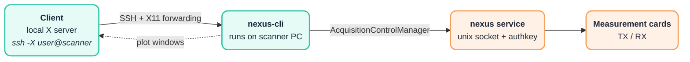

# Nexus CLI

Command-line interface for the [Nexus console](https://github.com/schote/nexus-console), an open-source Python console for low-field MRI ([Schote et al., MRM 2025](https://doi.org/10.1002/mrm.30406)).

The CLI is a thin client for the running Nexus acquisition service. It provides a fast way to inspect the system, edit the global acquisition parameter, run basic calibrations and execute arbitrary Pulseq `.seq` files, without writing Python.

This repository contains a minimal set of calibration routines (like `f0`, `b1`, `shims`), system tests (like `gradient`) and a generic sequence runner. Sequences and their headers must be created separately, e.g. with [PyPulseq](https://github.com/imr-framework/pypulseq), and passed to `run-sequence`.

## Overview

- [Nexus CLI](#nexus-cli)
  - [Overview](#overview)
  - [Installation](#installation)
  - [Remote access via SSH](#remote-access-via-ssh)
  - [Command reference](#command-reference)
    - [`device-config`](#device-config)
    - [`sequence-system`](#sequence-system)
    - [`run-sequence`](#run-sequence)
    - [`plot-sequence`](#plot-sequence)
    - [`run-protocol`](#run-protocol)
    - [`parameter show`](#parameter-show)
    - [`parameter set`](#parameter-set)
    - [`calibrate f0`](#calibrate-f0)
    - [`calibrate b1`](#calibrate-b1)
    - [`calibrate shims`](#calibrate-shims)
    - [`tests gradient`](#tests-gradient)

## Installation

The CLI runs next to the Nexus console service and needs to be installed on the same system.

1. Install [uv](https://docs.astral.sh/uv/):

   ```bash
   curl -LsSf https://astral.sh/uv/install.sh | sh
   ```

2. Clone the repository (assuming the nexus service is already set up, see [Service deployment](https://github.com/schote/nexus-console/blob/authentication/src/nexus_service/deployment/README.md) for deployment instructions):

   ```bash
   git clone https://github.com/schote/nexus-cli.git
   ```

3. Install the CLI into a virtual environment:

   ```bash
   cd nexus-cli
   uv sync
   ```

4. Create the configuration file and adapt the paths:

   ```bash
   mkdir -p ~/.config/nexus && cp .env.example ~/.config/nexus/.env
   ```

   | Variable | Meaning |
   | --- | --- |
   | `NEXUS_PARAMETER_FILE` | Acquisition parameter state file (default is `~/nexus-console/acquisition-parameter.state`) |
   | `NEXUS_EXPORT_DIR` | Export directory for `run-sequence` (required unless `--export-dir` is given) |

   Variables set in the shell take precedence over the file.

5. Run the CLI:

   ```bash
   uv run nexus-cli --help          # or: source .venv/bin/activate && nexus-cli --help
   ```

### Optional: Install the CLI app as a tool

When executed in the nexus-cli repository, the following command installs the CLI in its own isolated environment and links the executable onto `PATH`. This allows you to run commands like `nexus-cli ...` from anywhere (without the command prefix `uv run ...`).

```bash
uv tool install --editable .
```


## Remote access via SSH

The CLI must run on the console, next to the Nexus service. However, we can use it via SSH and display the matplotlib windows on the client via X11 forwarding.

Plots are opened by a separate viewer process: the CLI command returns as soon as the acquisition is done and the plot windows stay open (also across commands and after logging out) until you close them.



- Nexus console system: enable `X11Forwarding yes` in `/etc/ssh/sshd_config` and restart `sshd`.
- Client: run an X server (Linux: built-in, macOS: [XQuartz](https://www.xquartz.org/), Windows: [VcXsrv](https://sourceforge.net/projects/vcxsrv/)).
- Connect and run:

  ```bash
  ssh -X user@scanner
  cd nexus-cli && uv run nexus-cli --help
  ```

## Command reference

Append `--help` to any of the commands below to get instructions.

### `device-config`

Print the device configuration (`device_config.yaml`) loaded by the running service.

```bash
nexus-cli device-config
```

### `sequence-system`

Print the PyPulseq `Opts` system limits derived from the device configuration. Use them to construct sequences that are compatible with the scanner.

```bash
nexus-cli sequence-system
```

### `run-sequence`

Load a `.seq` file, execute it with the current acquisition parameter and optionally export the data as ISMRMRD.

```bash
nexus-cli run-sequence --path tse_3d.seq --mrd-header-path tse_3d.xml
nexus-cli run-sequence --path tse_3d.seq --mrd-header-path tse_3d.xml --export-dir ~/nexus-data
```

| Option | Type | Description |
| --- | --- | --- |
| `--path` | path | Pulseq sequence file (`.seq`), required |
| `--mrd-header-path` | path | ISMRMRD header (`.xml`). If given, the acquisition is saved as an ISMRMRD file |
| `--export-dir` | path | Export directory, defaults to `NEXUS_EXPORT_DIR` |

Without `--mrd-header-path` the sequence is executed, but no file is written.

### `plot-sequence`

Load a `.seq` file and plot it, either as Pulseq sequence or as waveforms unrolled by the Nexus service with the current acquisition parameter.

```bash
nexus-cli plot-sequence --path tse_3d.seq
nexus-cli plot-sequence --path tse_3d.seq --plot-unrolled
```

| Option | Type | Default | Description |
| --- | --- | --- | --- |
| `--path` | path | | Pulseq sequence file (`.seq`), required |
| `--plot-unrolled / --no-plot-unrolled` | flag | `--no-plot-unrolled` | Plot the unrolled waveforms instead of the Pulseq sequence |

### `run-protocol`

Run a protocol, i.e. a list of sequence and pause steps defined in a JSON file. Each sequence step is executed like `run-sequence` with the given header, a pause step waits for `duration` seconds. Relative paths are resolved against the directory of the protocol file.

```bash
nexus-cli run-protocol --path protocol.json
```

```json
{
  "name": "example",
  "steps": [
    {"type": "sequence", "sequence": "tse_3d.seq", "header": "tse_3d.xml"},
    {"type": "pause", "duration": 10, "message": "Waiting"}
  ]
}
```

A YAML protocol is also accepted, see [`examples/protocol.yaml`](examples/protocol.yaml) for an example. A pause step without `duration` waits for the user.

| Option | Type | Description |
| --- | --- | --- |
| `--path` | path | Protocol file (`.json` or `.yaml`), required |
| `--export-dir` | path | Export directory, defaults to `NEXUS_EXPORT_DIR` |

### `parameter show`

Print the current acquisition parameter and the state file it is bound to.

```bash
nexus-cli parameter show
nexus-cli parameter show --json
```

| Option | Type | Description |
| --- | --- | --- |
| `--json` | flag | Print as JSON |

### `parameter set`

Set one or more values. Only the given options are changed, each change is written to the state file immediately.

```bash
nexus-cli parameter set --larmor-frequency 2.038e6 --b1-scaling 0.5
nexus-cli parameter set --gradient-offset 0.1 -0.2 0.05 --ddc-method fir
nexus-cli parameter set --num-averages 4 --averaging-delay 1.0
```

| Option | Type | Description |
| --- | --- | --- |
| `--larmor-frequency` | float | Larmor frequency in Hz |
| `--b1-scaling` | float | Scaling of the RF transmit amplitude |
| `--gradient-offset X Y Z` | 3 × float | Gradient offsets in mV |
| `--fov-scaling X Y Z` | 3 × float | FOV scaling per gradient axis |
| `--channel-assignment X Y Z` | 3 × int | Console output channels for gradient x, y, z |
| `--ddc-method` | `FIR`, `AVG`, `CIC` | Decimation filter, case-insensitive |
| `--num-averages` | int ≥ 1 | Number of averages |
| `--averaging-delay` | float ≥ 0 | Delay between averages in s |

### `calibrate f0`

Acquire a single spin-echo spectrum (TE 10 ms, 20 kHz bandwidth, 1000 samples) and set `larmor_frequency` to the spectral peak. The update is skipped with a warning if the SNR is below `--min-snr`.

```bash
nexus-cli calibrate f0
nexus-cli calibrate f0 --min-snr 15 --no-show-plot
```

| Option | Type | Default | Description |
| --- | --- | --- | --- |
| `--min-snr` | float | `20` | Minimum SNR in dB to apply the correction |
| `--show-plot / --no-show-plot` | flag | `--show-plot` | Show time signal and spectrum |

### `calibrate b1`

Sweep the flip angle with FID acquisitions (RF duration 150 µs, 20 kHz bandwidth) and rescale `b1_scaling` such that the first signal maximum corresponds to 90°.

```bash
nexus-cli calibrate b1
nexus-cli calibrate b1 --start 30 --stop 180 --steps 16 --delay 1000
```

| Option | Type | Default | Description |
| --- | --- | --- | --- |
| `--start` | int | `45` | First flip angle in degrees |
| `--stop` | int | `225` | Last flip angle in degrees |
| `--steps` | int | `10` | Number of flip angles |
| `--delay` | int | `2000` | Delay between acquisitions in ms |
| `--center-window` | int | `100` | Width of the spectral integration window in samples |
| `--show-plot / --no-show-plot` | flag | `--show-plot` | Show signal integral vs. flip angle |

### `calibrate shims`

Optimise the first-order shims (gradient offsets) by coordinate descent on the FID peak amplitude (45° flip angle). The step size starts at `--start-range` and shrinks by 0.75 per x/y/z cycle until it falls below `--end-range`. Sets `gradient_offset` and corrects `larmor_frequency` for the residual offset.

```bash
nexus-cli calibrate shims
nexus-cli calibrate shims --start-range 0.2 --end-range 0.005 --show-plot
```

| Option | Type | Default | Description |
| --- | --- | --- | --- |
| `--start-range` | float | `0.1` | Initial step size in mT/m |
| `--end-range` | float | `0.01` | Stop when the step size falls below this value (mT/m) |
| `--num-dummies` | int | `3` | Dummy FIDs before the optimisation |
| `--show-plot / --no-show-plot` | flag | `--no-show-plot` | Show initial vs. shimmed FID, spectrum and convergence |

Gradient offsets are always reset to zero before shimming starts.

### `tests gradient`

Play out a periodic train of trapezoidal gradients on the selected channels, e.g. to test gradient amplifiers and coils under load. Each period contains one trapezoid at the end of the period, its area corresponds to `--duty-cycle` times a rectangular gradient with maximum amplitude over the whole period. The expected gradient strength, GPA output current and console output voltage per channel are printed, and the sequence is only executed after confirmation with Enter. The sequence contains no ADC events, no data is acquired.

```bash
nexus-cli tests gradient
nexus-cli tests gradient --channels x --max-amplitude 0.5 --duty-cycle 0.1 --total-duration 60 --show-plot
```

| Option | Type | Default | Description |
| --- | --- | --- | --- |
| `--channels` | str | `xyz` | Gradient channels, any combination of `x`, `y` and `z` |
| `--max-amplitude` | float | `1.0` | Gradient amplitude relative to the maximum gradient of the sequence system |
| `--period` | float | `0.1` | Duration of one period in s |
| `--duty-cycle` | float | `0.2` | Fraction of the period with gradient at maximum amplitude |
| `--total-duration` | float | `300` | Total duration of the test in s |
| `--rise-time` | float | | Rise time of the trapezoids in s, defaults to the fastest rise time of the sequence system |
| `--show-plot / --no-show-plot` | flag | `--no-show-plot` | Plot the sequence before execution |
